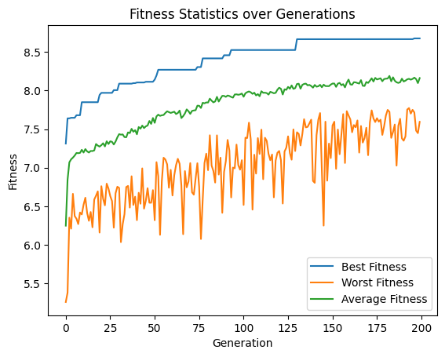
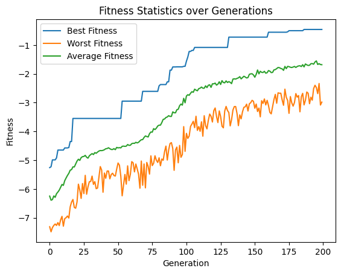
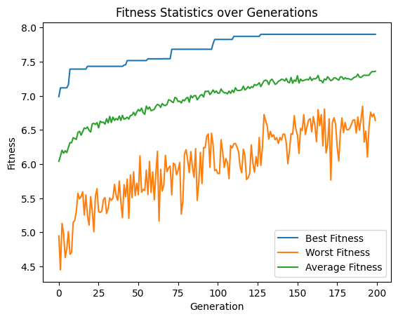

# Aesthetic Optimization Results
The Aesthetics Evaluator is based on the LAION Aesthetics Predictor V2. Source: https://laion.ai/blog/laion-aesthetics/ and GitHub https://github.com/christophschuhmann/improved-aesthetic-predictor. 

Findings: 
* Using a greater population size is recommended to allow for variation in the population
* Mutation should be restricted to a reasonable CLAMP range. When these values are exceeded the generational model produces weird results. 
* Arithmetic Crossover works well with default configuration and 0.5
* Elitism helped in exploitation, otherwise good results would have gotten lost 

## Optimizing a GA for Maximum Aesthetics with SDXL Turbo
Optimizing the aesthetics predictor as a maximization problem, the algorithm came to a max Aesthetics score of **8.67**.
This score is higher than [the examples from the real LAION English Subset dataset have](http://captions.christoph-schuhmann.de/aesthetic_viz_laion_sac+logos+ava1-l14-linearMSE-en-2.37B.html).
A wide variety of prompts (inspired by parti prompts) was used for the initial population.

https://github.com/malthee/evolutionary-diffusion-results/assets/18032233/4841d671-639a-4ac4-b7a8-ee5a66fab28d



Parameters: 
```python
population_size = 100
num_generations = 200
batch_size = 1
elitism = 1

creator = SDXLPromptEmbeddingImageCreator(pipeline_factory=setup_pipeline, batch_size=batch_size, inference_steps=3)
evaluator = AestheticsImageEvaluator()  
crossover = PooledArithmeticCrossover(crossover_rate=0.5, crossover_rate_pooled=0.5)
mutation_arguments = UniformGaussianMutatorArguments(mutation_rate=0.1, mutation_strength=2, clamp_range=(-900, 900)) 
mutation_arguments_pooled = UniformGaussianMutatorArguments(mutation_rate=0.1, mutation_strength=0.3, clamp_range=(-8, 8))
mutator = PooledUniformGaussianMutator(mutation_arguments, mutation_arguments_pooled)
selector = TournamentSelector(tournament_size=3)
```

[View the full notebook](./ga_200gen_100pop_aesthetic.ipynb)

## Optimizing a GA for Minimum Aesthetics with SDXL Turbo
Optimizing the aesthetics predictor as a minimization problem, the algorithm came to a min Aesthetics score of **0.457**. Similar to above
this was able to beat any real image from the dataset.

https://github.com/malthee/evolutionary-diffusion-results/assets/18032233/4352cdc0-20d6-4547-864d-e174f52204f3



Parameters:
```python
population_size = 100
num_generations = 200
batch_size = 1
elitism = 1

creator = SDXLPromptEmbeddingImageCreator(pipeline_factory=setup_pipeline, batch_size=batch_size, inference_steps=3)
evaluator = InverseEvaluator(AestheticsImageEvaluator()) # Inverting aesthetics to try getting the worst image
crossover = PooledArithmeticCrossover(crossover_rate=0.5, crossover_rate_pooled=0.5)
mutation_arguments = UniformGaussianMutatorArguments(mutation_rate=0.1, mutation_strength=2, clamp_range=(-900, 900)) 
mutation_arguments_pooled = UniformGaussianMutatorArguments(mutation_rate=0.1, mutation_strength=0.3, clamp_range=(-8, 8))
mutator = PooledUniformGaussianMutator(mutation_arguments, mutation_arguments_pooled)
selector = TournamentSelector(tournament_size=3)
```

[View the full notebook](./ga_200gen_100pop_invaesthetic.ipynb)

## Optimizing a GA for Maximum Aesthetics with SD Turbo 
Trying out a similar experiment with comparable parameters switching out SDXL for SD Turbo. This resulted in a final score of **7.9**, which is lower than its SDXL variant. 

https://github.com/malthee/evolutionary-diffusion-results/assets/18032233/549f3536-1b2f-4732-9e45-0f6a57ebd34c



Parameters
```python
population_size = 100
num_generations = 200
batch_size = 1
elitism = 1
inference_steps = 3

creator = SDPromptEmbeddingImageCreator(pipeline_factory=setup_pipeline, batch_size=batch_size, inference_steps=inference_steps)
evaluator = AestheticsImageEvaluator() 
crossover = ArithmeticCrossover(0.5)
mutation_arguments = UniformGaussianMutatorArguments(mutation_rate=0.1, mutation_strength=0.4, clamp_range=(-10.3, 15.65)) 
mutator = UniformGaussianMutator(mutation_arguments)
selector = TournamentSelector(tournament_size=3)
```

[View the full notebook](./sd_ga_200gen_100pop_aesthetic.ipynb)
