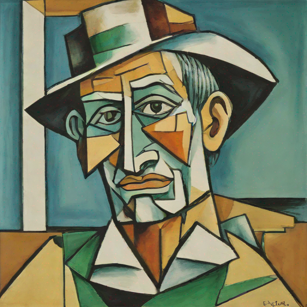
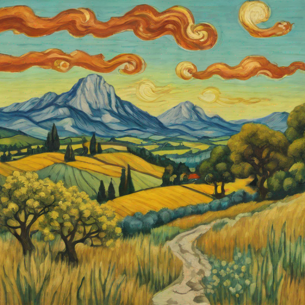

# Interesting Image Results across all Experiments
The following are results that I picked across all Experiments which I have found interesting.

## Island GA with Aesthetics
Experiment of combining random prompt embeddings with weighted artist embeddings. Images come from different generations of the algorithm. 

The results show a diverse range of images, escaping the artist's style and creating something new.

|    |    |    |    |
| --- | --- | --- | --- |
|  |  |  |  |  
|  |  |  | 

[View the full folder](./island_aesthetics/)
