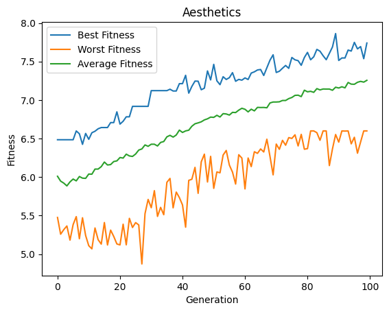
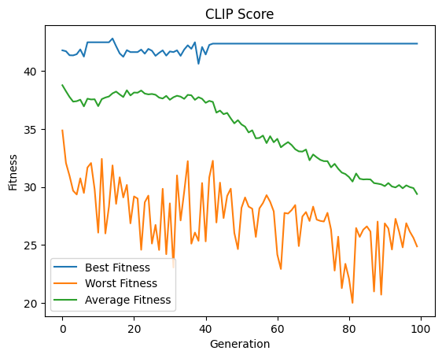

# Multi-Objective Optimization for Aesthetics and CLIP-Score Results
* The Aesthetics Evaluator is based on the LAION Aesthetics Predictor V2. Source: https://laion.ai/blog/laion-aesthetics/ and GitHub https://github.com/christophschuhmann/improved-aesthetic-predictor. 
* CLIP-Score https://lightning.ai/docs/torchmetrics/stable/multimodal/clip_score.html

Findings:
* CLIP-Score tends to not improve very much from the original result. Average and worst fitness seem to get worse over time.
* Aesthetics-Score was able to improve, but also not by much.

## Optimizing with NSGA II, starting with single Prompt
Optimizing the aesthetics and CLIP-Score predictors as a multi-objective problem, the algorithm came to a max Aesthetics score 

| Aesthetics | CLIP-Score |
| --- | --- |
|  |  |

Parameters
```python
prompt = "a cat sitting on a lamp in austria"
population_size = 100
num_generations = 100
batch_size = 1
elitism = 1

creator = SDXLPromptEmbeddingImageCreator(pipeline_factory=setup_pipeline, batch_size=batch_size, inference_steps=3)
evaluator = MultiObjectiveEvaluator([AestheticsImageEvaluator(), CLIPScoreEvaluator(prompt=prompt)])
crossover = PooledArithmeticCrossover(crossover_rate=0.5, crossover_rate_pooled=0.5)
mutation_arguments = UniformGaussianMutatorArguments(mutation_rate=0.1, mutation_strength=2.5, clamp_range=(-900, 900)) 
mutation_arguments_pooled = UniformGaussianMutatorArguments(mutation_rate=0.1, mutation_strength=0.5, clamp_range=(-8, 8))
mutator = PooledUniformGaussianMutator(mutation_arguments, mutation_arguments_pooled)
selector = TournamentSelector(tournament_size=3)

# Prepare initial arguments
init_embed = creator.arguments_from_prompt(prompt)
init_args = [init_embed for _ in range(population_size)]

nsga = NSGA_II(
    num_generations=num_generations,
    population_size=population_size,
    solution_creator=creator,
    selector=selector,
    crossover=crossover,
    mutator=mutator,
    evaluator=evaluator,
    elitism_count=elitism,
    initial_arguments=init_args,
    post_evaluation_callback=lambda g, a: save_images_from_generation(a.population, g) 
)
```

[View the full notebook](./nsga_100gen_100pop_aes_clips.ipynb)
