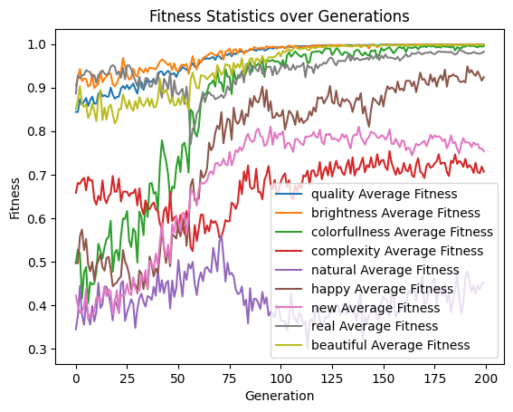

# Multi-Objective Optimization for Metrics in CLIP Image Quality Assessment
CLIP-IQA https://lightning.ai/docs/torchmetrics/stable/multimodal/clip_iqa.html

Findings:
* It is possible to optimize for multiple metrics at once
* The results are interesting, may not be exactly what you expect

## Optimizing with NSGA II for 9 metrics, starting with Random Embeddings
It has been shown that improvement in fitness can be made even with many criteria at the same time.

https://github.com/malthee/evolutionary-diffusion-results/assets/18032233/a0828dc2-248c-44b1-8cac-1cbabbbe238d



Parameters
```python
population_size = 100
num_generations = 200
batch_size = 1
elitism = 1
metrics = ("quality", "brightness", "colorfullness", "complexity", "natural", "happy", "new", "real", "beautiful")

embedding_range = SDXLTurboEmbeddingRange()
pooled_embedding_range = SDXLTurboPooledEmbeddingRange()
creator = SDXLPromptEmbeddingImageCreator(batch_size=batch_size, inference_steps=3)
evaluator = MultiCLIPIQAEvaluator(metrics=metrics)
crossover = PooledArithmeticCrossover(crossover_rate=0.5, crossover_rate_pooled=0.5)
mutation_arguments = UniformGaussianMutatorArguments(mutation_rate=0.1, mutation_strength=2, 
                                                     clamp_range=(embedding_range.minimum, embedding_range.maximum)) 
mutation_arguments_pooled = UniformGaussianMutatorArguments(mutation_rate=0.1, mutation_strength=0.4, 
                                                            clamp_range=(pooled_embedding_range.minimum, pooled_embedding_range.maximum))
mutator = PooledUniformGaussianMutator(mutation_arguments, mutation_arguments_pooled)
selector = TournamentSelector(tournament_size=3)

# Prepare initial arguments
init_args = [PooledPromptEmbedData(embedding_range.random_tensor_in_range(), pooled_embedding_range.random_tensor_in_range()) 
             for _ in range(population_size)] # random start

nsga = NSGA_II(
    num_generations=num_generations,
    population_size=population_size,
    solution_creator=creator,   
    selector=selector,
    crossover=crossover,
    mutator=mutator,
    evaluator=evaluator,
    elitism_count=elitism,
    initial_arguments=init_args,
    post_non_dominated_sort_callback=save_images_post_sort
)
```

[View the full notebook](./nsga_200gen_100pop_iqavariation.ipynb)
