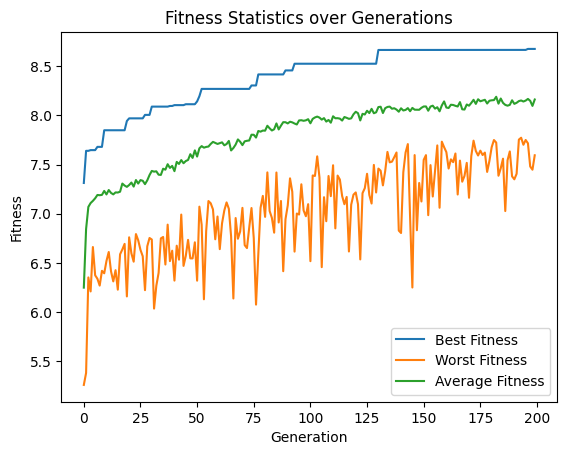
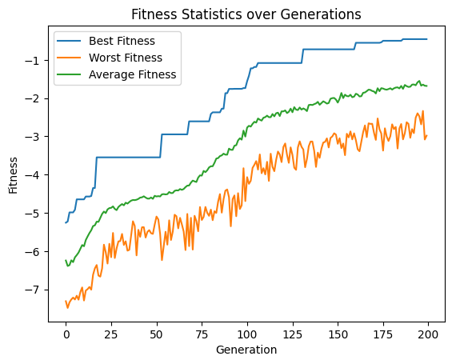
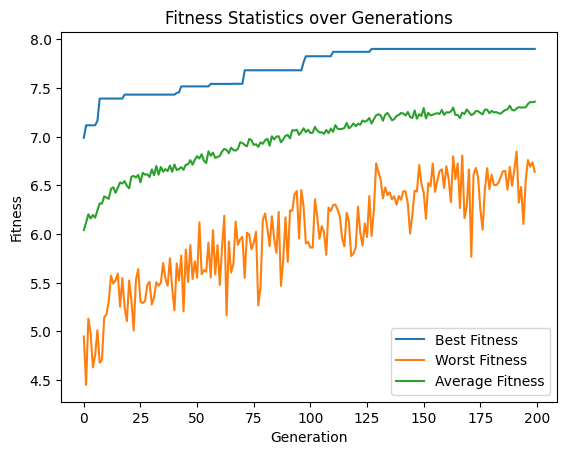
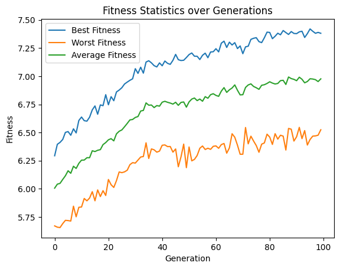
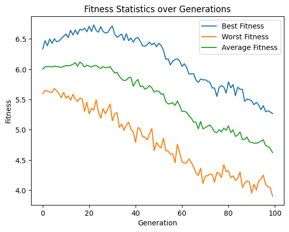
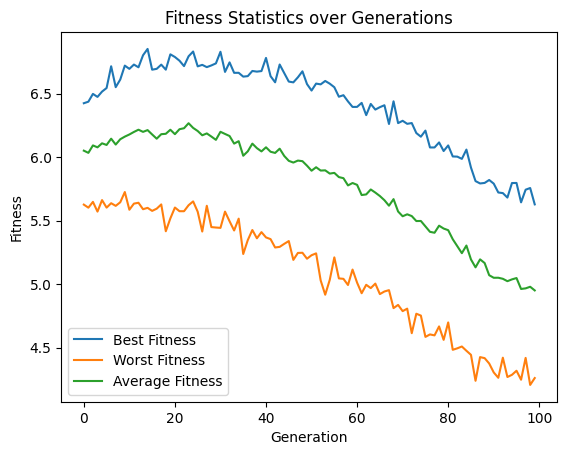

# Aesthetic Optimization Results
The Aesthetics Evaluator is based on the LAION Aesthetics Predictor V2. Source: https://laion.ai/blog/laion-aesthetics/ and GitHub https://github.com/christophschuhmann/improved-aesthetic-predictor. 

Findings: 
* Using a greater population size is recommended to allow for variation in the population. Experiments with a lower population size and less diversity converged very quickly.
* Mutation should be restricted to a reasonable CLAMP range. When these values are exceeded the generational model produces weird results. 
* Arithmetic Crossover works well with default configuration and 0.5 crossover rate.
* Elitism helped in exploitation, otherwise good results would have gotten lost 
* Island GA 
    * Tends to lose diversity on islands quickly when selection pressure is high
    * With less selection pressure improves to a certain extent then drops in fitness 

## Optimizing a GA for Maximum Aesthetics with SDXL Turbo
Optimizing the aesthetics predictor as a maximization problem, the algorithm came to a max Aesthetics score of **8.67**.
This score is higher than [the examples from the real LAION English Subset dataset have](http://captions.christoph-schuhmann.de/aesthetic_viz_laion_sac+logos+ava1-l14-linearMSE-en-2.37B.html).
A wide variety of prompts (inspired by parti prompts) was used for the initial population.

https://github.com/malthee/evolutionary-diffusion-results/assets/18032233/4841d671-639a-4ac4-b7a8-ee5a66fab28d



Parameters: 
```python
population_size = 100
num_generations = 200
batch_size = 1
elitism = 1

creator = SDXLPromptEmbeddingImageCreator(pipeline_factory=setup_pipeline, batch_size=batch_size, inference_steps=3)
evaluator = AestheticsImageEvaluator()  
crossover = PooledArithmeticCrossover(crossover_rate=0.5, crossover_rate_pooled=0.5)
mutation_arguments = UniformGaussianMutatorArguments(mutation_rate=0.1, mutation_strength=2, clamp_range=(-900, 900)) 
mutation_arguments_pooled = UniformGaussianMutatorArguments(mutation_rate=0.1, mutation_strength=0.3, clamp_range=(-8, 8))
mutator = PooledUniformGaussianMutator(mutation_arguments, mutation_arguments_pooled)
selector = TournamentSelector(tournament_size=3)
```

[View the full notebook](./ga_200gen_100pop_aesthetic.ipynb)

## Optimizing a GA for Minimum Aesthetics with SDXL Turbo
Optimizing the aesthetics predictor as a minimization problem, the algorithm came to a min Aesthetics score of **0.457**. Similar to above
this was able to beat any real image from the dataset.

https://github.com/malthee/evolutionary-diffusion-results/assets/18032233/4352cdc0-20d6-4547-864d-e174f52204f3



Parameters:
```python
population_size = 100
num_generations = 200
batch_size = 1
elitism = 1

creator = SDXLPromptEmbeddingImageCreator(pipeline_factory=setup_pipeline, batch_size=batch_size, inference_steps=3)
evaluator = InverseEvaluator(AestheticsImageEvaluator()) # Inverting aesthetics to try getting the worst image
crossover = PooledArithmeticCrossover(crossover_rate=0.5, crossover_rate_pooled=0.5)
mutation_arguments = UniformGaussianMutatorArguments(mutation_rate=0.1, mutation_strength=2, clamp_range=(-900, 900)) 
mutation_arguments_pooled = UniformGaussianMutatorArguments(mutation_rate=0.1, mutation_strength=0.3, clamp_range=(-8, 8))
mutator = PooledUniformGaussianMutator(mutation_arguments, mutation_arguments_pooled)
selector = TournamentSelector(tournament_size=3)
```

[View the full notebook](./ga_200gen_100pop_invaesthetic.ipynb)

## Optimizing a GA for Maximum Aesthetics with SD Turbo 
Trying out a similar experiment with comparable parameters switching out SDXL for SD Turbo. This resulted in a final score of **7.9**, which is lower than its SDXL variant. 

https://github.com/malthee/evolutionary-diffusion-results/assets/18032233/549f3536-1b2f-4732-9e45-0f6a57ebd34c



Parameters
```python
population_size = 100
num_generations = 200
batch_size = 1
elitism = 1
inference_steps = 3

creator = SDPromptEmbeddingImageCreator(pipeline_factory=setup_pipeline, batch_size=batch_size, inference_steps=inference_steps)
evaluator = AestheticsImageEvaluator() 
crossover = ArithmeticCrossover(0.5)
mutation_arguments = UniformGaussianMutatorArguments(mutation_rate=0.1, mutation_strength=0.4, clamp_range=(-10.3, 15.65)) 
mutator = UniformGaussianMutator(mutation_arguments)
selector = TournamentSelector(tournament_size=3)
```

[View the full notebook](./sd_ga_200gen_100pop_aesthetic.ipynb)

## Optimizing an Island-GA with Different Artists for Aesthetics and SDXL Turbo
Starting each island with random prompt embeddings combined with embeddings of an artist (e.g. Picasso, Van Gogh, etc.) and optimizing for aesthetics with SDXL Turbo. The aesthetics score reached around **7.3** but the results were much more diverse than when focussing straight on aesthetics score.  
Diversity on the islands was lost after few migrations.

TODO video



Parameters
```python
population_size = 10
num_generations = 100
batch_size = 1
elitism = None
inference_steps = 3
artists = [
    "Leonardo da Vinci",  # Renaissance
    "Michelangelo Buonarroti",  # Renaissance
    "Raphael",  # Renaissance
    "Rembrandt van Rijn",  # Dutch Golden Age
    "Johannes Vermeer",  # Dutch Golden Age
    "Claude Monet",  # Impressionism
    "Pierre-Auguste Renoir",  # Impressionism
    "Vincent van Gogh",  # Post-Impressionism
    "Paul Cézanne",  # Post-Impressionism
    "Paul Gauguin",  # Post-Impressionism
    "Georges Seurat",  # Post-Impressionism, Pointillism
    "Gustav Klimt",  # Symbolism, Art Nouveau
    "Edvard Munch",  # Symbolism, Expressionism
    "Henri Matisse",  # Fauvism, Modernism
    "Pablo Picasso",  # Cubism, Surrealism, Modernism
    "Salvador Dalí",  # Surrealism
    "Frida Kahlo",  # Surrealism, Symbolism
    "Jackson Pollock",  # Abstract Expressionism
    "Andy Warhol",  # Pop Art
    "Mark Rothko"  # Abstract Expressionism
]  # 20 Artists


embedding_range = SDXLTurboEmbeddingRange()
pooled_embedding_range = SDXLTurboPooledEmbeddingRange()
creator = SDXLPromptEmbeddingImageCreator(batch_size=batch_size, inference_steps=inference_steps)
evaluator = AestheticsImageEvaluator() 
crossover = PooledArithmeticCrossover(crossover_rate=0.5, crossover_rate_pooled=0.5)
mutation_arguments = UniformGaussianMutatorArguments(mutation_rate=0.05, mutation_strength=1.5, 
                                                     clamp_range=(embedding_range.minimum, embedding_range.maximum)) 
mutation_arguments_pooled = UniformGaussianMutatorArguments(mutation_rate=0.05, mutation_strength=0.2, 
                                                            clamp_range=(pooled_embedding_range.minimum, pooled_embedding_range.maximum))
mutator = PooledUniformGaussianMutator(mutation_arguments, mutation_arguments_pooled)
selector = TournamentSelector(tournament_size=3)

ga_instances = []

init_crossover = PooledArithmeticCrossover(crossover_rate=0.9, crossover_rate_pooled=0.9)
for artist in artists:
    artist_arg = creator.arguments_from_prompt(f"by {artist}") 

    init_args = [init_crossover.crossover(artist_arg,  # Combine the artist with a random image, weighted towards the artist
                                          PooledPromptEmbedData(embedding_range.random_tensor_in_range(), pooled_embedding_range.random_tensor_in_range())) 
                 for _ in range(population_size)]
    
    # Create and run the genetic algorithm
    ga_instances.append(GeneticAlgorithm(
        population_size=population_size,
        num_generations=num_generations,
        solution_creator=creator,
        evaluator=evaluator,
        mutator=mutator,
        crossover=crossover,
        selector=selector,
        initial_arguments=init_args,
        elitism_count=elitism,
        post_evaluation_callback=save_images_post_evaluation,
    ))

island_model = IslandModel(
    ga_instances,
    migration_size=1, # In this version migration size was per island, future versions use a global total count
    migration_interval=1, 
)
```

[View the full notebook](./island_ga_100gen_200pop_randomartists.ipynb)

### Tuning Mutation/Selection
Used RouletteWheelSelection and reduced Mutation to combat the loss of original artist style. 
Aesthetics seemed to improve for a bit, but then through missing pressure dropped until images were not really usable anymore.  
Removed artists with similar style or period for diversity.

TODO Video




Parameters
```python
population_size = 10
num_generations = 100
batch_size = 1
elitism = None
inference_steps = 3
artists = [
    "Leonardo da Vinci",  # Renaissance
    "Michelangelo Buonarroti",  # Renaissance
    "Raphael",  # Renaissance
    "Johannes Vermeer",  # Dutch Golden Age
    "Claude Monet",  # Impressionism
    "Pierre-Auguste Renoir",  # Impressionism
    "Vincent van Gogh",  # Post-Impressionism
    "Georges Seurat",  # Post-Impressionism, Pointillism
    "Gustav Klimt",  # Symbolism, Art Nouveau
    "Edvard Munch",  # Symbolism, Expressionism
    "Henri Matisse",  # Fauvism, Modernism
    "Pablo Picasso",  # Cubism, Surrealism, Modernism
    "Salvador Dalí",  # Surrealism
    "Frida Kahlo",  # Surrealism, Symbolism
    "Jackson Pollock",  # Abstract Expressionism
    "Andy Warhol",  # Pop Art
    "Mark Rothko"  # Abstract Expressionism
]  # 17 Artists


embedding_range = SDXLTurboEmbeddingRange()
pooled_embedding_range = SDXLTurboPooledEmbeddingRange()
creator = SDXLPromptEmbeddingImageCreator(batch_size=batch_size, inference_steps=inference_steps)
evaluator = AestheticsImageEvaluator() 
crossover = PooledUniformCrossover(crossover_rate=0.8, crossover_rate_pooled=0.8)
mutation_arguments = UniformGaussianMutatorArguments(mutation_rate=0.05, mutation_strength=1.5, 
                                                     clamp_range=(embedding_range.minimum, embedding_range.maximum)) 
mutation_arguments_pooled = UniformGaussianMutatorArguments(mutation_rate=0.05, mutation_strength=0.2, 
                                                            clamp_range=(pooled_embedding_range.minimum, pooled_embedding_range.maximum))
mutator = PooledUniformGaussianMutator(mutation_arguments, mutation_arguments_pooled)
selector = RouletteWheelSelector()

ga_instances = []

init_crossover = PooledArithmeticCrossover(crossover_rate=0.8, crossover_rate_pooled=0.8)
for artist in artists:
    artist_arg = creator.arguments_from_prompt(f"by {artist}") 

    init_args = [init_crossover.crossover(artist_arg,  # Combine the artist with a random image, weighted towards the artist
                                          PooledPromptEmbedData(embedding_range.random_tensor_in_range(), pooled_embedding_range.random_tensor_in_range())) 
                 for _ in range(population_size)]
    
    ga_instances.append(GeneticAlgorithm(
        population_size=population_size,
        num_generations=num_generations,
        solution_creator=creator,
        evaluator=evaluator,
        mutator=mutator,
        crossover=crossover,
        selector=selector,
        initial_arguments=init_args,
        elitism_count=elitism,
        post_evaluation_callback=save_images_post_evaluation,
    ))

island_model = IslandModel(
    ga_instances,
    migration_size=1,
    migration_interval=1,
)
```

[View the full notebook](./island_ga_100gen_170pop_randomartists_lowpressure.ipynb)

### Tuning Crossover/Selection
Tried Uniform Crossover and RankSelection to see if it combats the problem of aesthetics loss.  
In comparison it got a little bit better and it *only* reached 4.3 at the end while the other one reached around 4. Still the artist styles were lost in the end with images not being usable anymore.

TODO Video



Parameters
```python
population_size = 10
num_generations = 100
batch_size = 1
elitism = None
inference_steps = 3
artists = [
    "Leonardo da Vinci",  # Renaissance
    "Michelangelo Buonarroti",  # Renaissance
    "Raphael",  # Renaissance
    "Johannes Vermeer",  # Dutch Golden Age
    "Claude Monet",  # Impressionism
    "Pierre-Auguste Renoir",  # Impressionism
    "Vincent van Gogh",  # Post-Impressionism
    "Georges Seurat",  # Post-Impressionism, Pointillism
    "Gustav Klimt",  # Symbolism, Art Nouveau
    "Edvard Munch",  # Symbolism, Expressionism
    "Henri Matisse",  # Fauvism, Modernism
    "Pablo Picasso",  # Cubism, Surrealism, Modernism
    "Salvador Dalí",  # Surrealism
    "Frida Kahlo",  # Surrealism, Symbolism
    "Jackson Pollock",  # Abstract Expressionism
    "Andy Warhol",  # Pop Art
    "Mark Rothko"  # Abstract Expressionism <- TODO do ga with this
]  # 17 Artists

embedding_range = SDXLTurboEmbeddingRange()
pooled_embedding_range = SDXLTurboPooledEmbeddingRange()
creator = SDXLPromptEmbeddingImageCreator(batch_size=batch_size, inference_steps=inference_steps)
evaluator = AestheticsImageEvaluator() 
crossover = PooledUniformCrossover(crossover_rate=0.7, crossover_rate_pooled=0.7)
mutation_arguments = UniformGaussianMutatorArguments(mutation_rate=0.05, mutation_strength=1.5, 
                                                     clamp_range=(embedding_range.minimum, embedding_range.maximum)) 
mutation_arguments_pooled = UniformGaussianMutatorArguments(mutation_rate=0.05, mutation_strength=0.2, 
                                                            clamp_range=(pooled_embedding_range.minimum, pooled_embedding_range.maximum))
mutator = PooledUniformGaussianMutator(mutation_arguments, mutation_arguments_pooled)
selector = RankSelector()

ga_instances = []

init_crossover = PooledArithmeticCrossover(crossover_rate=0.7, crossover_rate_pooled=0.7)
for artist in artists:
    artist_arg = creator.arguments_from_prompt(f"by {artist}") 

    init_args = [init_crossover.crossover(artist_arg,  # Combine the artist with a random image, weighted towards the artist
                                          PooledPromptEmbedData(embedding_range.random_tensor_in_range(), pooled_embedding_range.random_tensor_in_range())) 
                 for _ in range(population_size)]
    
    # Create and run the genetic algorithm
    ga_instances.append(GeneticAlgorithm(
        population_size=population_size,
        num_generations=num_generations,
        solution_creator=creator,
        evaluator=evaluator,
        mutator=mutator,
        crossover=crossover,
        selector=selector,
        initial_arguments=init_args,
        elitism_count=elitism,
        post_evaluation_callback=save_images_post_evaluation,
    ))

island_model = IslandModel(
    ga_instances,
    migration_size=1,
    migration_interval=2,
)
```

[View the full notebook](./island_ga_100gen_170pop_randomartists_midpressure.ipynb)