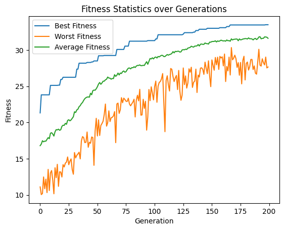

# CLIP-Score Optimization
CLIP-Score https://lightning.ai/docs/torchmetrics/stable/multimodal/clip_score.html

Findings:  
* It is possible to optimize to a specific prompt or description from random embeddings
* It is also possible to find from an artist embedding to another artist embedding
* Both scoring as well or better than directly generated images
* CLIPScore optimization tends to go to the extremes in image composition, directly generating by prompt is more balanced
* The scoring and style direction strongly depends on the CLIP model chosen

## Trying to "Find" a Prompt from Random Embeddings
Initializing the population with random embeddings and measuring fitness with CLIP-Score containing the prompt.  
**Prompt:** "surreal simulation of the universe, fantasy crazy unimaginable 4k high quality ultra hd beautiful"

https://github.com/malthee/evolutionary-diffusion-results/assets/18032233/e088cd7c-4904-41d2-b4ff-bdfb3066edc1



Parameters
```python
population_size = 100
num_generations = 200
batch_size = 1
elitism = 1
inference_steps = 3
prompt = "surreal simulation of the universe, fantasy crazy unimaginable 4k high quality ultra hd beautiful"

embedding_range = SDXLTurboEmbeddingRange()
pooled_embedding_range = SDXLTurboPooledEmbeddingRange()
creator = SDXLPromptEmbeddingImageCreator(batch_size=batch_size, inference_steps=inference_steps)
evaluator = CLIPScoreEvaluator(prompt=prompt) 
crossover = PooledArithmeticCrossover(crossover_rate=0.5, crossover_rate_pooled=0.5)
mutation_arguments = UniformGaussianMutatorArguments(mutation_rate=0.05, mutation_strength=3, 
                                                     clamp_range=(embedding_range.minimum, embedding_range.maximum)) 
mutation_arguments_pooled = UniformGaussianMutatorArguments(mutation_rate=0.05, mutation_strength=0.7, 
                                                            clamp_range=(pooled_embedding_range.minimum, pooled_embedding_range.maximum))
mutator = PooledUniformGaussianMutator(mutation_arguments, mutation_arguments_pooled)
selector = TournamentSelector(tournament_size=3)

# Prepare initial arguments, random population of *reasonable* prompt embeddings
init_args = [PooledPromptEmbedData(embedding_range.random_tensor_in_range(), pooled_embedding_range.random_tensor_in_range()) 
             for _ in range(population_size)]

ga = GeneticAlgorithm(
    population_size=population_size,
    num_generations=num_generations,
    solution_creator=creator,
    evaluator=evaluator,
    mutator=mutator,
    crossover=crossover,
    selector=selector,
    initial_arguments=init_args,
    elitism_count=elitism,
    post_evaluation_callback=save_images_post_evaluation,
)
```

| Optimized Image | Images directly generated with prompt |
| --- | --- |
|  |  |

The optimized image is a bit more colorful and fits the CLIP-Score a few points better than the prompt images. Quality-wise the prompt images seem to be a bit better.

[View the full notebook](./ga_100gen_200pop_surreal.ipynb)

## Trying to Optimize for "Aesthetics" by using the CLIP-Score
The idea is to use the CLIP-Score as a fitness function to optimize for aesthetics by defining the prompt as "aesthetic".

https://github.com/malthee/evolutionary-diffusion-results/assets/18032233/e6e0c419-2768-41eb-9f75-c2d47e5a8d92

Parameters
```python
population_size = 100
num_generations = 200
batch_size = 1
elitism = 1
inference_steps = 3
prompt = "aesthetic"

embedding_range = SDXLTurboEmbeddingRange()
pooled_embedding_range = SDXLTurboPooledEmbeddingRange()
creator = SDXLPromptEmbeddingImageCreator(batch_size=batch_size, inference_steps=inference_steps)
evaluator = CLIPScoreEvaluator(prompt=prompt) 
crossover = PooledArithmeticCrossover(crossover_rate=0.5, crossover_rate_pooled=0.5)
mutation_arguments = UniformGaussianMutatorArguments(mutation_rate=0.05, mutation_strength=3, 
                                                     clamp_range=(embedding_range.minimum, embedding_range.maximum)) 
mutation_arguments_pooled = UniformGaussianMutatorArguments(mutation_rate=0.05, mutation_strength=0.7, 
                                                            clamp_range=(pooled_embedding_range.minimum, pooled_embedding_range.maximum))
mutator = PooledUniformGaussianMutator(mutation_arguments, mutation_arguments_pooled)
selector = TournamentSelector(tournament_size=3)

# Prepare initial arguments, random population of *reasonable* prompt embeddings
init_args = [PooledPromptEmbedData(embedding_range.random_tensor_in_range(), pooled_embedding_range.random_tensor_in_range()) 
             for _ in range(population_size)]

ga = GeneticAlgorithm(
    population_size=population_size,
    num_generations=num_generations,
    solution_creator=creator,
    evaluator=evaluator,
    mutator=mutator,
    crossover=crossover,
    selector=selector,
    initial_arguments=init_args,
    elitism_count=elitism,
    post_evaluation_callback=save_images_post_evaluation,
)
```

| Optimized Image | Images directly generated with prompt |
| --- | --- |
|  |  |

Interesting is that both results are using a pinkish color palette. The optimized image is a bit "over the top" but fits the CLIP-Score a few points better than the prompt images.

[View the full notebook](./ga_100gen_200pop_aesthetics.ipynb)

## Transitioning from an Artist Embedding to another Artist
In two experiments with different CLIPScore models (default vit-base-patch16 and another vit-large-patch14) the goal was to go from one style to another. Initializing the population with 0.8 weighted prompts to the artist and 0.2 random.

base-16:  

https://github.com/malthee/evolutionary-diffusion-results/assets/18032233/7b77cb1b-52d7-4522-873f-86b5d86e5535

large-14:  

https://github.com/malthee/evolutionary-diffusion-results/assets/18032233/b6b7e357-9c92-4978-9ad5-816965693375

```python
population_size = 100
num_generations = 200
batch_size = 1
elitism = 1
inference_steps = 3
crossover_proportion = 0.7
crossover_rate = 0.9
mutation_rate = 0.3
strict_osga = False
initial_prompt = "by Leonardo da Vinci"
goal_prompt = "by Banksy"

# Define min/max values for the prompt embeddings
embedding_range = SDXLTurboEmbeddingRange()
pooled_embedding_range = SDXLTurboPooledEmbeddingRange()
# Create the necessary components for the genetic algorithm
creator = SDXLPromptEmbeddingImageCreator(batch_size=batch_size, inference_steps=inference_steps)
evaluator = CLIPScoreEvaluator(goal_prompt, clip_model="openai/clip-vit-large-patch14") # Clip model differs between experiments
crossover = PooledArithmeticCrossover(interpolation_weight=0.5, interpolation_weight_pooled=0.5, 
                                      proportion=crossover_proportion, proportion_pooled=crossover_proportion)
mutation_arguments = UniformGaussianMutatorArguments(mutation_rate=0.05, mutation_strength=3, 
                                                     clamp_range=(embedding_range.minimum, embedding_range.maximum)) 
mutation_arguments_pooled = UniformGaussianMutatorArguments(mutation_rate=0.05, mutation_strength=0.7, 
                                                            clamp_range=(pooled_embedding_range.minimum, pooled_embedding_range.maximum))
mutator = PooledUniformGaussianMutator(mutation_arguments, mutation_arguments_pooled)
selector = TournamentSelector(tournament_size=3)

# Prepare initial arguments, random population of *reasonable* prompt embeddings mixed with the initial prompt
init_crossover = PooledArithmeticCrossover(interpolation_weight=0.8, interpolation_weight_pooled=0.8)
initial_prompt_arg = creator.arguments_from_prompt(initial_prompt) 
init_args = [init_crossover.crossover(initial_prompt_arg,  
                                      PooledPromptEmbedData(embedding_range.random_tensor_in_range(), pooled_embedding_range.random_tensor_in_range())) 
                 for _ in range(population_size)]
```
